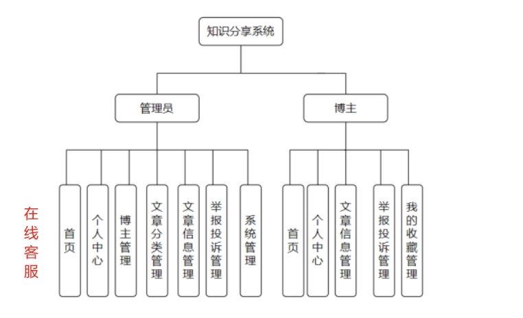
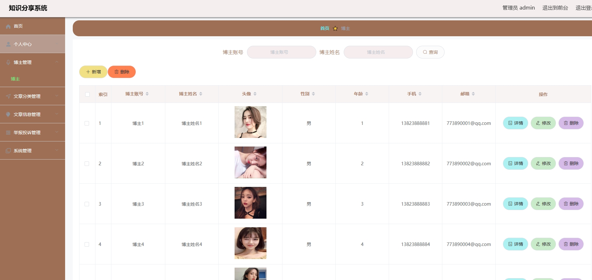
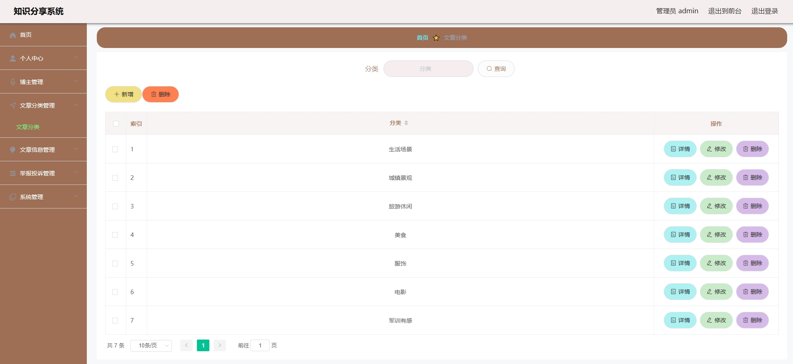
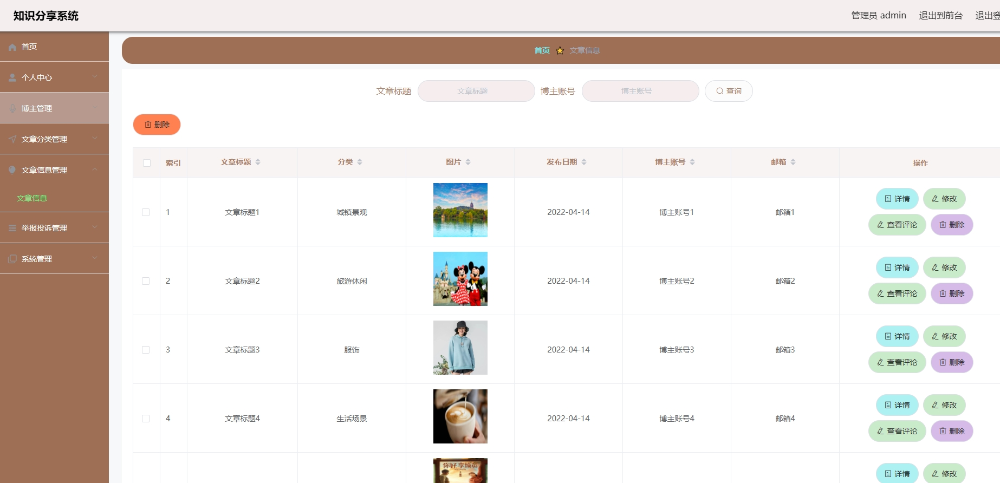
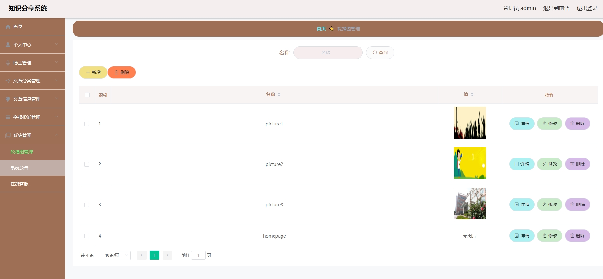
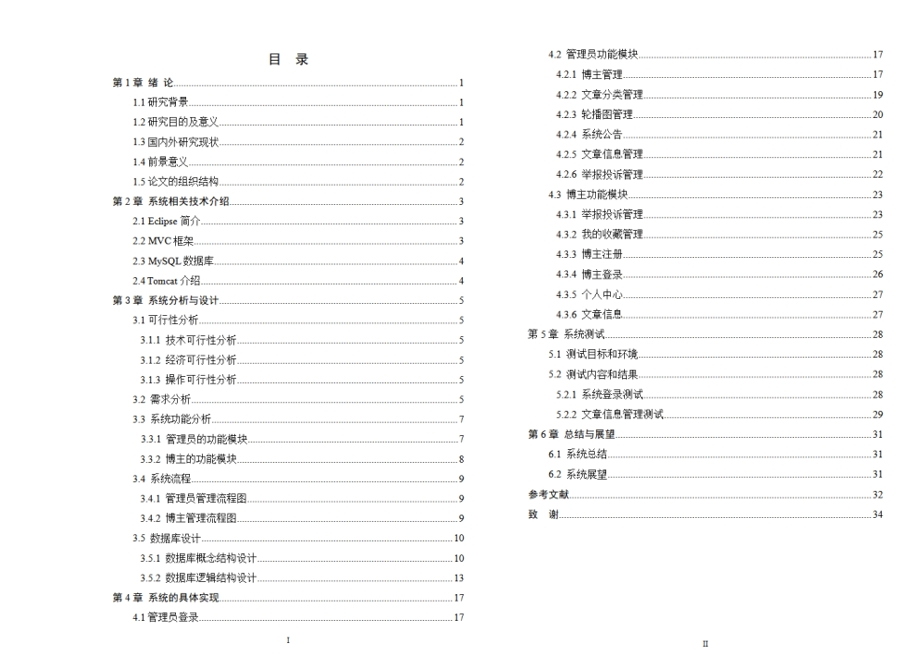

1.项目介绍
测试环境：IDEA2022，Navicat，Maven3，MySQL5.7+

技术选型：SpringBoot，vue.js，layui，shiro，MyBatis-Plus，hutool，fastjson

项目结构图

2.项目部署
通过Navicat创建数据库，编码为utf8mb4，然后导入sql文件
通过idea打开项目，根据本地数据库环境修改src/main/resources/application.yml  11-14行
运行项目
后端管理web：http://localhost:8080/springboot60zv5/admin/dist/index.html#/login (可以通过vscode或者webstorm自行打包resource/admin下的项目)
门户： 右键src/main/resources/front/front/index.html，点击运行即可
3.项目部分截图

